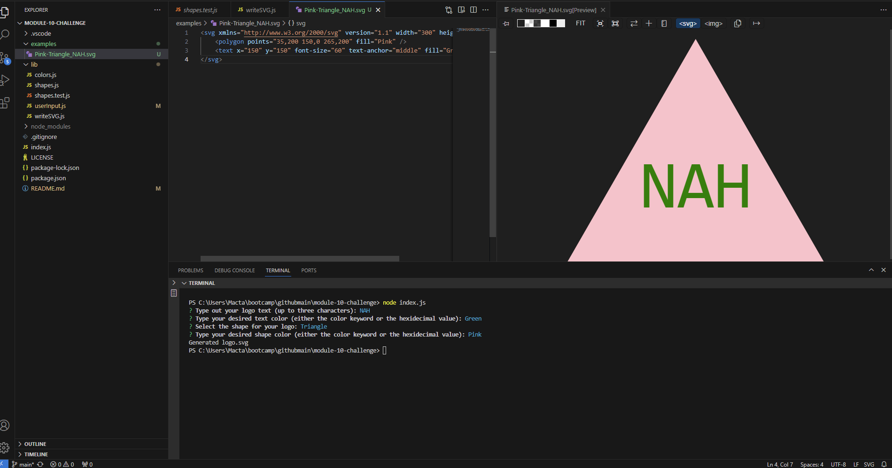

# Logo-Generator
GitHub Repo: https://github.com/jheersink8/logo-generator 

## Description

To see a demonstration of this tool, please watch this video: 

This tool is used to generate simple .SVG files through the CLI that contain a shape and text. The user can choose from three shapes and set the color for the shape and the text. This tool is meant to demonstrate a working knowledge of:

- Node.js
- The inquirer npm
- Testing/Jest
- Classes
- Constructor functions
- Inheritance

## Installation
- Install Node.js using the download link above if it’s not already installed 
- Using GitBash (or your preferred CLI), navigate to the folder you want to clone the repo to and run: git clone https://github.com/jheersink8/logo-generator
- Open the repo using VS Code
- From the VS Code terminal run the command: npm install inquirer @8.2.4 
- From the VS Code terminal run the command: npm install jest
- From the VS Code terminal, CD into the directory which contains index.js
- Run the command: node index.js

## Usage
After invoking the node index.js command, the user will be presented with four questions: 
- Type out your logo text (up to three characters):',
- Type your desired text color (either the color keyword or the hexidecimal value):',
- Select the shape for your logo:',
- Type your desired shape color (either the color keyword or the hexidecimal value):',

Each question has validation built in so that the user cannot enter an invalid input. Once all four questions have been answered, an .SVG file will be generated in the examples folder with the naming convention of (shape-color)-(shape)_(text). The .SVG file can then be viewed in a browser or opened in any image viewer that can view .SVG files. 

## Credits
- Scenario presented by Denver University in the Bootcamp course ID DU-VIRT-FSF-PT-12-2023-U-LOLC-MWTH under Module 10 Challenge. All code was modified and submitted by Jordan R. Heersink.
- This tool uses node.js, the inquirer v 8.2.4 npm, and jest

## License
https://opensource.org/licenses/MIT 

  Copyright (c) {{ 2024 }} {{ Jordan Heersink }}

    Permission is hereby granted, free of charge, to any person obtaining a copy
    of this software and associated documentation files (the "Software"), to deal
    in the Software without restriction, including without limitation the rights
    to use, copy, modify, merge, publish, distribute, sublicense, and/or sell
    copies of the Software, and to permit persons to whom the Software is
    furnished to do so, subject to the following conditions:
    
    The above copyright notice and this permission notice shall be included in all
    copies or substantial portions of the Software.
    
    THE SOFTWARE IS PROVIDED "AS IS", WITHOUT WARRANTY OF ANY KIND,
    EXPRESS OR IMPLIED, INCLUDING BUT NOT LIMITED TO THE WARRANTIES OF
    MERCHANTABILITY, FITNESS FOR A PARTICULAR PURPOSE AND NONINFRINGEMENT.
    IN NO EVENT SHALL THE AUTHORS OR COPYRIGHT HOLDERS BE LIABLE FOR ANY CLAIM,
    DAMAGES OR OTHER LIABILITY, WHETHER IN AN ACTION OF CONTRACT, TORT OR
    OTHERWISE, ARISING FROM, OUT OF OR IN CONNECTION WITH THE SOFTWARE OR THE USE
    OR OTHER DEALINGS IN THE SOFTWARE.